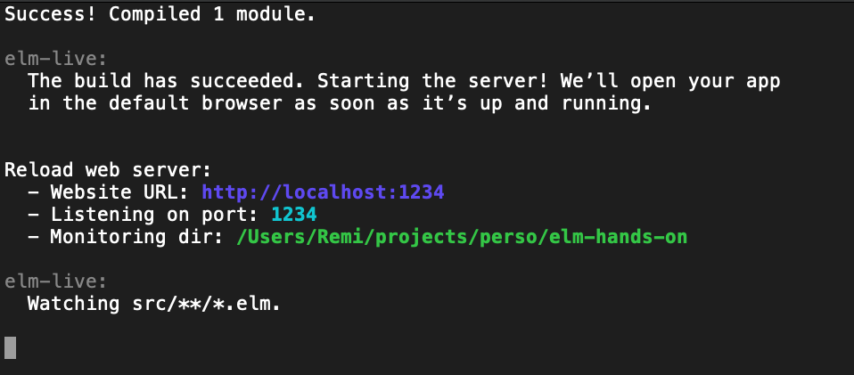

# Elm hands-on

This projects aims to introduce Elm basics as a hands-on project

## Startup

Install [Git](https://git-scm.com/downloads) if it is not already done

### Install `elm`

#### MacOS

Prerequisites: [Homebrew](https://brew.sh/index_fr)

- Install elm: `brew install elm`
- Install or update npm: `brew install npm` or `brew upgrade npm`
- Install [elm-live](https://github.com/wking-io/elm-live): `npm install -g elm-live`

#### Unix 
- Install elm: `apt-get install elm`
- Install or update npm: `apt-get install npm` or `apt-get upgrade npm`
- Install [elm-live](https://github.com/wking-io/elm-live): `npm install -g elm-live`

#### Windows
- Install elm: [Windows Installer](https://guide.elm-lang.org/install.html)
- Install or update npm: [Node](https://nodejs.org/en/download/)
- Install [elm-live](https://github.com/wking-io/elm-live): `npm install -g elm-live`

### Unit tests
Install [elm-test](https://github.com/elm-community/elm-test): `npm install -g elm-test`

### Formatter
Install [elm-format](https://github.com/avh4/elm-format) following this startup guide: [Install Elm format](https://github.com/avh4/elm-format)

This aims to format using Elm style guide when saving.

## Check configuration

```
➜  ~ elm --version     
0.19.0
➜  ~ elm-live --version
3.2.3
➜  ~ elm-test --version
0.19.0-rev6
➜  ~ elm-format --help 
elm-format 0.8.1

Usage: elm-format [INPUT] [--output FILE] [--yes] [--validate] [--stdin]
                  [--elm-version VERSION] [--upgrade]
  Format Elm source files.

Available options:
  -h,--help                Show this help text
  --output FILE            Write output to FILE instead of overwriting the given
                           source file.
  --yes                    Reply 'yes' to all automated prompts.
  --validate               Check if files are formatted without changing them.
  --stdin                  Read from stdin, output to stdout.
  --elm-version VERSION    The Elm version of the source files being formatted.
                           Valid values: 0.18, 0.19. Default: auto
  --upgrade                Upgrade older Elm files to Elm 0.19 syntax

Examples:
  elm-format Main.elm                     # formats Main.elm
  elm-format Main.elm --output Main2.elm  # formats Main.elm as Main2.elm
  elm-format src/                         # format all *.elm files in the src directory

Full guide to using elm-format at <https://github.com/avh4/elm-format>
➜  ~ 
```

## Step-0: Hello World

- Checkout the project and switch to branch `step-0`: 
```git
git checkout step-0
```

- Try compiling the code:
```
elm make src/Main.elm
```
When running this command, elm transpiles elm code to javascript inside `index.html` file.

- Open `index.html` in a browser and you should see your first Elm application 

- Rewrite `index.html` file with following content:

```html
<!DOCTYPE HTML>
<html>
<head>
  <meta charset='UTF-8'>
  <title>Main</title>
</head>

<body>
<div id='elm-f0111bc4e658d0f98db96260c16f7e49'></div>
<script src='main.js'></script>
<script>
  Elm.Main.init({ node: document.getElementById('elm-f0111bc4e658d0f98db96260c16f7e49') });
</script>
</body>
</html>
```

- Run the following command: `elm make src/Main.elm --output=main.js`

- Reload `index.html` in your browser. You should see the same output as before but now, the elm compiler will generate `main.js`.

## Step-1: elm-live 

[elm-live](https://github.com/wking-io/elm-live) is a flexible dev server for Elm which includes hot-reload. 

- Install [`elm-live`](#hot-reload) if not already done 

- Run the following command: `elm-live src/Main.elm --port=1234 --open  -- --output=main.js --debug`

You should see as following: 


- Update `Main.elm` to change the output message and save.

See your browser and notice it should have reloaded the page automatically.

## Step-2: Elm ecosystem

### REPL: `elm repl`

This REPL (*Read Eval Print Loop*) allows you to run any elm statement in the terminal (eg. to check syntax or semantics).

- Run elm repl: `elm repl`

- Develop and evaluate following expressions:
   - Adding `40` and `2` (let's start easy)
   - Create a function which adds two numbers (*integer*) and call it 
   - Create a function which takes a login in parameter and returns "Hello " + login
   - Create a function which takes a `Maybe String` and returns "Hello " + login if login is defined and "Hello World" otherwise.

### Package manager: `elm-package`

As for node, `elm` has a package manager which let us publish or download packages from [Elm packages](https://package.elm-lang.org/).

A package is one or several modules and you can see them as a collection of utilities function (that are exposed).

Package are prefixed with the module author nickname (or elm for core modules) and then the package name separated with a `/` (eg. `mdgriffith/elm-ui`). 

- Install `elm/svg` package

- Notice the dependency package in the `elm-stuff/packages` directory

- Use your application to draw a circle (use documentation) or any forms you want

### Online editor: [Ellie](https://ellie-app.com/new)

Use this online editor if you want to try some code without having a local project.