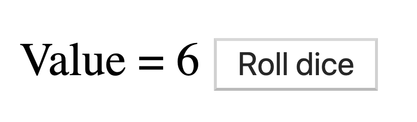

# Elm hands-on

This projects aims to introduce Elm basics as a hands-on project

## Startup

### MacOS

Prerequisites: [Homebrew](https://brew.sh/index_fr)

- Install elm: `brew install elm`
- Install or update npm: `brew install npm` or `brew upgrade npm`
- Install [elm-live](https://github.com/wking-io/elm-live): `npm install -g elm-live`
- Start application: `elm-live src/Main.elm --port=1234 --open -- --output=main.js`

### Unix 
- Install elm: `apt-get install elm`
- Install or update npm: `apt-get install npm` or `apt-get upgrade npm`
- Install [elm-live](https://github.com/wking-io/elm-live): `npm install -g elm-live`
- Start application: `elm-live src/Main.elm --port=1234 --open -- --output=main.js`

### Windows
- Install elm: [Windows Installer](https://guide.elm-lang.org/install.html)
- Install or update npm: [Node](https://nodejs.org/en/download/)
- Install [elm-live](https://github.com/wking-io/elm-live): `npm install -g elm-live`
- Start application: `elm-live src/Main.elm --port=1234 --open -- --output=main.js`

## Technologies 
Written in [Elm 0.19.0](https://elm-lang.org/)


### Code style guide
I recommend using [NoRedInk Elm style guide](https://github.com/NoRedInk/elm-style-guide) which defines some basic rules for naming and styling our code.

### Hot-reload
Install [elm-live](https://github.com/wking-io/elm-live): `npm install -g elm-live`

Start application: `elm-live src/Main.elm --port=1234 --open -- --output=main.js`

### Unit tests
Install [elm-test](https://github.com/elm-community/elm-test): `npm install -g elm-test`

Run unit tests: `elm-test --watch`

### Formatter
Install [elm-format](https://github.com/avh4/elm-format) following this startup guide: [Install Elm format](https://github.com/avh4/elm-format)

This aims to format using Elm style guide when saving.


## Check configuration

Elm version should be **0.19.0**
```
➜  ~ elm --version
0.19.0
```

## Step-0: Hello World

- Checkout the project and switch to branch `step-0`: 
```git
git checkout step-0
```

- Try compiling the code:
```
elm make src/Main.elm
```
When running this command, elm transpiles elm code to javascript inside `index.html` file.

- Open `index.html` in a browser and you should see your first Elm application 

- Rewrite `index.html` file with following content:

```html
<!DOCTYPE HTML>
<html>
<head>
  <meta charset='UTF-8'>
  <title>Main</title>
</head>

<body>
<div id='elm-f0111bc4e658d0f98db96260c16f7e49'></div>
<script src='main.js'></script>
<script>
  Elm.Main.init({ node: document.getElementById('elm-f0111bc4e658d0f98db96260c16f7e49') });
</script>
</body>
</html>
```

- Run the following command: `elm make src/Main.elm --output=main.js`

- Reload `index.html` in your browser. You should see the same output as before but now, the elm compiler will generate `main.js`.

## Step-1: elm-live 

[elm-live](https://github.com/wking-io/elm-live) is a flexible dev server for Elm which includes hot-reload. 

- Install [`elm-live`](#hot-reload) if not already done 

- Run the following command: `elm-live src/Main.elm --port=1234 --open  -- --output=main.js`

You should see as following: 


- Update `Main.elm` to change the output message and save.

See your browser and notice it should have reloaded the page automatically.

## Step-2: Elm ecosystem

### REPL: `elm repl`

This REPL (*Read Eval Print Loop*) allows you to run any elm statement in the terminal (eg. to check syntax or semantics).

- Run elm repl: `elm repl`

- Develop and evaluate following expressions:
   - Adding `40` and `2` (let's start easy)
   ```elm
   40 + 2
   ```
   
   - Create a function which adds two numbers (*integer*) and call it 
   ```elm
   > add i j = i + j
   <function> : number -> number -> number
   > add 40 2
   42 : number
   ```
   - Create a function which takes a login in parameter and returns "Hello " + login
   ```elm
   > hello login = "Hello " ++ login
   <function> : String -> String
   > hello "Rémi"
   "Hello Rémi" : String
   ```
   - Create a function which takes a `Maybe String` and returns "Hello " + login if login is defined and "Hello World" otherwise.
   ```elm
   > hello maybeLogin = case maybeLogin of \
   |   Nothing -> "Hello World"\
   |   Just login -> "Hello " ++ login
   <function> : Maybe String -> String
   > hello (Just "Rémi")
   "Hello Rémi" : String
   > hello Nothing
   "Hello World" : String
   ```

Bonus for currying:
```elm
> multiply a b = a * b 
<function> : number -> number -> number
> multiplyByThree a = multiply a 3
<function> : number -> number
> multiplyByThree 10
30 : number
```

### Package manager: `elm-package`

As for node, `elm` has a package manager which let us publish or download packages from [Elm packages](https://package.elm-lang.org/).

A package is one or several modules and you can see them as a collection of utilities function (that are exposed).

Package are prefixed with the module author nickname (or elm for core modules) and then the package name separated with a `/` (eg. `mdgriffith/elm-ui`). 

- Install `elm/svg` package

- Notice the dependency package in the `elm-stuff/packages` directory

- Use your application to draw a circle (use documentation) or any forms you want

### Online editor: [Ellie](https://ellie-app.com/new)

Use this online editor if you want to try some code without having a local project.

## Step-3: Elm syntax

### Boolean

`True` or `False`. Nothing else to explain.

### Arithmetic operators 

Kind of easy so let's skip this one (`+`, `-`, `*` and `/`)...

Small tips: `//` is also a division operator but it returns the Int value of it.

Note that these operators are functions so they can also be used in *prefix style* like `(+) 40 2`

Using it like `40 + 2` is called the **infix style**.

### Comparison

Nothing specific here except the `not equal` operator which look more like a different: `/=`
```
(==) = eq
(/=) = neq
(<)  = lt
(>)  = gt
(<=) = le
(>=) = ge
```

### Associativity 

Running `40 + 2 * 100` will return `240` (operator precedence).

If we want to execute `40 + 2` before multiplying it with `100` we need to explicitely tell so:
`(40 + 2) * 100`

### Basic types


### Conditions 

#### If statements
```elm
message : Int -> String
message age =
    if age > 30 then
        "You are older than me"

    else
        "You are younger than me"
```

#### Case statements (pattern matching)
```elm
message : Int -> String
message age =
    case age > 30 of
        True -> "You are older than me"
        False -> "You are younger than me"
```

### Functions

- **Fact 1**: A function always returns something!
- **Fact 2**: Explicitely write function signature helps!
- **Fact 3**: Function are testable (easily)

```elm
increment : Int -> Int -> Int 
increment a b = a + b
```

You can apply a function partially (currying):
```elm
multiplyByTwo : Int -> Int
multiplyByTwo a = increment a a
```

### Infix operator (my favourite)

When calling a function like: 
```elm
add : Int -> Int -> Int 
add a b = a + b
```

You have two possibilities: 
```elm
add 40 2 
2 |> add 40
```

`|>` means *appendLeft* and helps for code readability most of the time.

### Let

`let` statement helps you extracting temporary variables before returning the function results.

For example:

```elm
addAndMultiplyBy Int -> Int -> Int -> Int
addAndMultiplyBy a b c = 
    let 
        addResult : Int 
        addResult = a + b
    in 
    addResult * c
```

This can also help in code-readability as to extract result operations in named variables.

## Step-4: The Elm Architecture

Elm program can be divided into three cleanly separated parts:


- *Model* — the state of your application
- *update* — a way to update your state
- *view* — a way to view your state as HTML

Writing a new Elm module often starts with the following skeleton:

```elm
module Module exposing (..)
import ...

-- MODEL

type alias Model = { ... }


-- UPDATE

type Msg = Write | ...

update : Msg -> Model -> Model
update msg model =
  case msg of
    Write -> model
    _ -> ...


-- VIEW

view : Model -> Html Msg
view model =
  ...
```

### Elm debugger - A time machine

You can enable Elm debugger easily by adding `--debug` option to your `elm-live` start-up:
`elm-live src/Counter.elm --port=1234 --open  -- --output=main.js --debug`

This gives you access to the bottom right panel:
 

Clicking on it will give you access to the history of any action done in your application so you can replay them one by one:
 

This can be very useful whenever you want to debug your application behaviour.

### Exercise 1: Counter

- Create a new Elm file `Counter.elm` in your `src` directory as below:

```elm
module Counter exposing (Model, Msg(..), initialModel, main, update, view)

import Browser
import Html exposing (Html, button, div, text)
import Html.Events exposing (onClick)


type alias Model =
    { count : Int }


initialModel : Model
initialModel =
    { count = 0 }


type Msg
    = Increment


update : Msg -> Model -> Model
update msg model =
    case msg of
        Increment ->
            { model | count = model.count + 1 }


view : Model -> Html Msg
view model =
    div []
        [ button [ onClick Increment ] [ text "+1" ]
        , div [] [ text <| String.fromInt model.count ]
        ]


main : Program () Model Msg
main =
    Browser.sandbox
        { init = initialModel
        , view = view
        , update = update
        }

```

- Run the program: `elm-live src/Counter.elm --port=1234 --open  -- --output=main.js`

- Implement `decrement` action

### Exercise 2: Text input

- Create a new Elm module: `Input.elm`
- This module should expose an input text and when typing, the state should be updated and a message `Hello ` + login should appear

- **Bonus**: Write "Hello World" whenever the typed value from input is empty

## Step-5: Handling side effects

If Elm is so reliable, it is because it relies on pure functions only so there will be no unexpected behaviour.  

### What is a *side effect*?

Side effects are any interactions with the outside world like:
- Send and receive data from a remote HTTP server.
- Save data to a local storage.
- Generate random numbers.
- Request a JavaScript library to perform an operation

But it can also be any operations like:
- Listen for web socket messages.
- Listen for location changes.
- Listen for clock ticks.
- Listen for an output generated by a JavaScript library  

These side effects are painful when developing an application because, by definition, we can't make sure they will always be executed as expected. 

### How Elm deals with side effects?


*Copyright © 2018 Pawan Poudel*

Elm Runtine will act as a proxy for any *outside* operations so our application is protected from anything unexpected happening. 

Let's take an example (from `elm/http`):
```elm
{-| A `Result` is either `Ok` meaning the computation succeeded, or it is an
`Err` meaning that there was some failure.
-}
type Result error value
    = Ok value
    | Err error
```

When requesting a resource via Http, Elm will allow us to deal with a `Result` than can either be `Ok` or `Err` if something bad happened.
In the end, when handling this result, anything will be explicitly handled as below:

```elm
type Msg = LoadedItem (Result Http.Error Item)

update : Msg -> Model -> ( Model, Cmd Msg )
update msg model =
    case msg of
        LoadedItem result ->
            case result of
                Ok fetchedItem ->
                    ( { model | item = fetchedItem }
                    , Cmd.none
                    )
            
                Err error ->
                    model |> failure error
    ...
```

In this particular case, the returned error can take multiple form as defined in the documentation:
```elm
{-| A `Request` can fail in a couple ways:

  - `BadUrl` means you did not provide a valid URL.
  - `Timeout` means it took too long to get a response.
  - `NetworkError` means the user turned off their wifi, went in a cave, etc.
  - `BadStatus` means you got a response back, but the [status code][sc]
    indicates failure.
  - `BadPayload` means you got a response back with a nice status code, but
    the body of the response was something unexpected. The `String` in this
    case is a debugging message that explains what went wrong with your JSON
    decoder or whatever.

[sc]: https://www.w3.org/Protocols/rfc2616/rfc2616-sec10.html
-}
type Error
  = BadUrl String
  | Timeout
  | NetworkError
  | BadStatus (Response String)
  | BadPayload String (Response String)
```

With Elm runtine, we can be sure that any side effects will be handled properly and should be solved in our application properly.

### Exercise: Roll a dice

- Install `elm/random` package
- Create a new Elm module (`Dice.elm`) as a Browser.element application (so we can interact with the outside world)
```elm
main : Program () Model Msg
main =
    Browser.element
        { init = initialModel
        , view = view
        , update = update
        , subscriptions = subscriptions
        }
```
- The application should be composed of a button to generate a number between 1 and 6 and the value should be rendered next to it as below:

- Few tips:
```elm
type alias Model =
    { value : Int }
```
```elm
type Msg
    = Roll
    | Rolled Int
```
To generate a random value, you can use this function which returns a `Cmd Msg` (Roll):
```elm
generate : Int -> Int -> Cmd Msg
generate min max =
    max
        |> Random.int min
        |> Random.generate Rolled
```